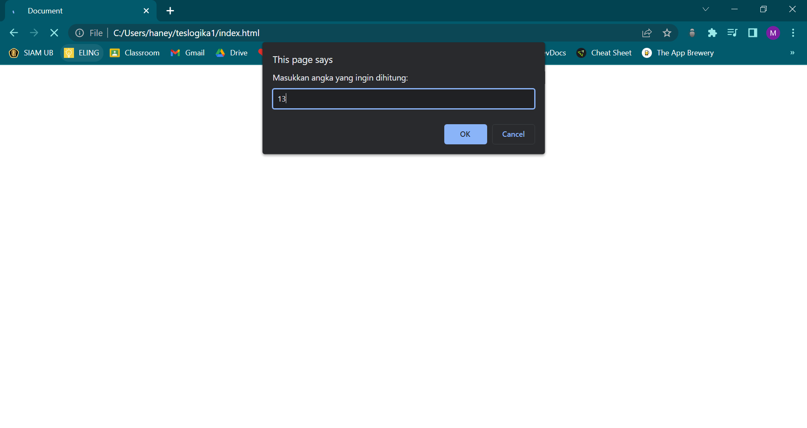

# finplan
Coding Test Front End Developer Intern

# ===== TES LOGIKA =====

## SOAL 1
##### 1. Pertama-tama, jalankan kode program dan masukkan angka yang ingin dihitung bilangan cacahnya!
         
   

